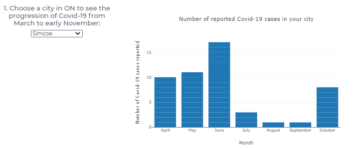
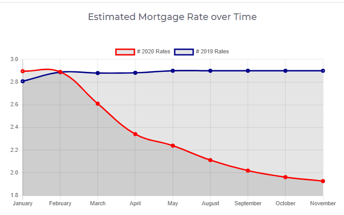

# GTA Real Estate Market vs Covid

## Background
Group Members:
-	Marina Ercoli 
-	Jorge Arriola Villafuerte
-	Ulisses Pinto 
-	Monica Lin 
-	Emilia Lubanska – Oledzka

Proposal:
We will continue leveraging the data that we used during the ETL project regarding the progression of COVID-19 cases and its impact on real state market indicators. Our initial goal is to create:

 Sample Visualizations

## Live webpage
https://firstappbootcamp2021.herokuapp.com/
--
### Copyright
dataPlus: ©www.dataPlus.com