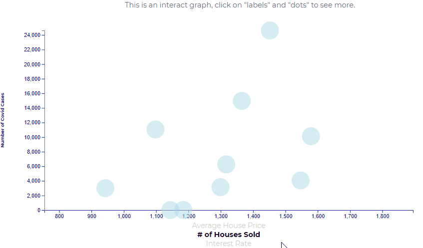
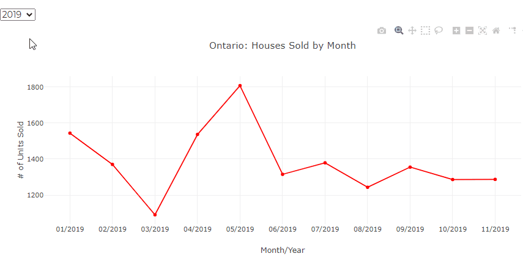

# Heroku App - Bootcamp Project 

Group Members:
-	Marina Ercoli 
-	Jorge Arriola Villafuerte
-	Ulisses Pinto 
-	Monica Lin 
-	Emilia Lubanska – Oledzka

## Background: GTA Real Estate Market vs Covid

The goal of this project was to create an app and deploy it using Flask and Heroku! 

Taking advantage of the data sets that we had transformed and loaded in a previous project, this time we wanted to create a data visualization to allow users to see:

1. the progression of Covid-19 in Ontario
2. the impact of Covid-19 on real estate indicators

These are the data sources that we used:

### Original data sources
1) COVID-2019 cases in Ontario (CSV): 
https://data.ontario.ca/dataset/confirmed-positive-cases-of-covid-19-in-ontario/resource/455fd63b-603d-4608-8216-7d8647f43350
2) Prices and number of houses sold in Ontario 2019/2020 (API): 
https://www.quandl.com/data/CMHC-Canadian-Mortgage-and-Housing-Corporation/documentation?anchor=about
3) Canadian Interest Rates - 2019/2020 (CSV):
https://www.bankofcanada.ca/rates/interest-rates/canadian-interest-rates/
4) Prices and number of houses sold in British Columbia (API):
https://www.quandl.com/data/CMHC/HPPU50_BC-Average-Median-and-Price-Percentiles-for-Unabsorbed-Homeowner-and-Condominium-Units-Provinces-British-Columbia

Here is our final app: https://firstappbootcamp2021.herokuapp.com/

### Transformation and Load (Final_Notebook_Load.ipynb)

The original data sets were full of unneeded information, thus we transformed them to reflect only the data we wanted to load in Elephant SQL, some of the transformation we did included:

1) Erase columns with information that were not relevant to us, for instance, when determining the number of houses sold in Ontario, the ‘type’ of house/construction was not relevant. Hence, we dropped this column.

2) Compile/Aggregate information, for example, the Government of Ontario’s data set for COVID-19 cases provides information for each one of the patients that got a positive result for COVID. We had to group the data by month and use the count function to get aggregate figures of how the number of COVID cases has fluctuated throughout 2020.

### App Functionality

We created a connection to Elephant SQL add-on on Heroku through my flask app (app.py). 

We created four routes for our API layer. Except, the url of each route relies on information that the user passes.

For the first route (`/api/v2/covid`), the user picks a `city` by selecting it in the drowpdown menu. That route will then run a query to the Elephant SQL database to get Month and Number of Codiv cases for that specific location.
---

The second API route (`/api/v2/scatter`) has the source data for the scatter plot. Each time an user picks a distint x-axis category, the route will run a query to the database. The data returned was used to generate a D3 scatterplot that plotted Number of Covid Cases on the y axis and had a clickable y axis where the user could decide whether they wanted to see Average House Price, Number of Houses Sold, Interest Rate.
---

The third API route (`/api/v2/covidTmp`), the user picks a `month` in the dropdown menu and it triggers the route to display in a map the cities that had confirmed cases of Covid. User can zoom in and out in the map and by clicking in a specific city the tooltips display the number of cases for that city. 
---

The fourth API route (`/api/v2/bar_line`) has the source data for three line graphs. The user interacts with the two first graphs by selecting a year in the dropdown menu then, the route will run a query to the database that will switch datasets for both graphs simuntaniously. The third graph interaction is done by choosing one of the years in the legend, this will trigger the route to return the data for that specif year only. Unlike the previous charts, we used D3 and Chat.js library to create this last line graph.
---

### Deployment

During deployment, we learnt an important lesson...the size of the dataset really matters when it comes to free deployment services. 

Because of the COVID-19 dataset, which had over 78000 rows, we had issues to deploy the app into Heroku. So, then, to overcome this big issue we decided to get a sample of this dataset, which reduced our COVID data to about 9000 rows. 

Lesson learned and, even though our final app need to be based on a sample dataset, it still provides to users a informative and simple to understand data visualization, they can interpret the impacts of COVID-19 in the real estate market.  

---
Feel free to reach out to us if you have any questions.

## Copyright
dataPlus: ©www.dataPlus.com